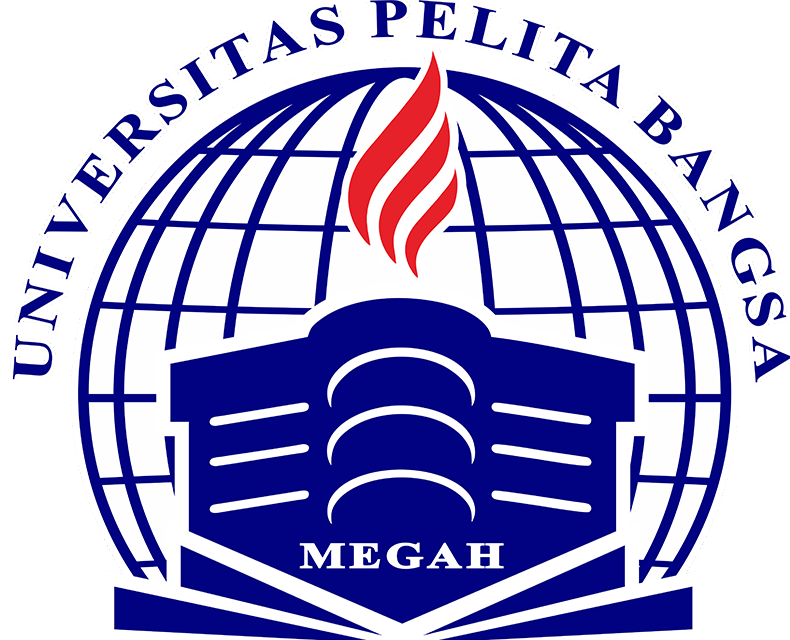
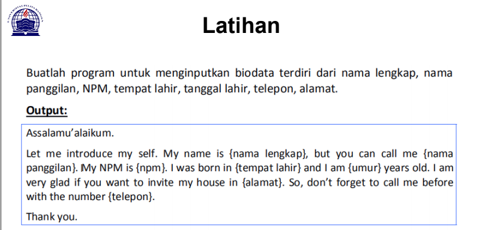

# TugasPertemuan6

**Nama :Risky HariAdi**
**Nim :312010124**
**Kelas:TI.A1.20**
**Tugas:Bahasa Pemrogramman**

# Pertemuan 5 - Tugas

Pada pertemuan 5 Bahasa Pemrograman saya diberi tugas oleh Dosen untuk membuat Aplikasi Biodata Python (seperti Gambar dibawah ini)

